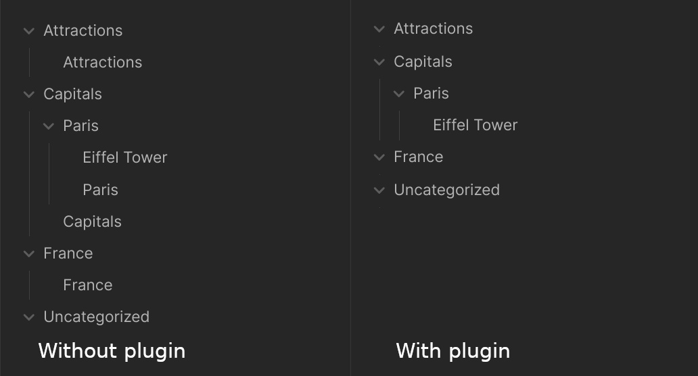

# Hide Index Files

Hides folder notes from the file explorer. Use with [folder-notes](https://github.com/LostPaul/obsidian-folder-notes) for the full experience.

## Why not just `folder-notes`?

`folder-notes` uses direct DOM patching and vault's `on(event)` listeners that may misbehave and be out of sync with file explorer's DOM tree. That causes `folder-notes` to fail to hide some of the folder notes. This is especially prominent with [lazy-cached-vault-load](https://github.com/d7sd6u/obsidian-lazy-cached-vault-load). This plugin on the other hand patches tree items directly and works flawlessly.

## Other plugins

- [lazy-cached-vault-load](https://github.com/d7sd6u/obsidian-lazy-cached-vault-load) - reduce startup time on mobile to 2-3s even with 30k+ notes vault
- [auto-folder-note-paste](https://github.com/d7sd6u/obsidian-auto-folder-note-paste) - makes sure your attachments are "inside" your note on paste and drag'n'drop by making your note a folder note
- [folders-graph](https://github.com/d7sd6u/obsidian-folders-graph) - adds folders as nodes to graph views
- [reveal-folded](https://github.com/d7sd6u/obsidian-reveal-folded) - reveal current file in file explorer while collapsing everything else
- [crosslink-advanced](https://github.com/d7sd6u/obsidian-crosslink-advanced) - adds commands to deal with [ftags](https://github.com/d7sd6u/obsidian-lazy-cached-vault-load?tab=readme-ov-file#wait-a-minute-what-are-folderindex-notes-what-are-ftags-what-do-you-mean-annexed)-oriented vaults: add ftags, create child note, open random unftagged file, etc.
- [virtual-dirs](https://github.com/d7sd6u/obsidian-virtual-dirs) - adds "virtual" folder files / folder indexes. You can open them, you can search for them, but they do not take space and "materialize" whenever you want a _real_ folder note
- [viewer-ftags](https://github.com/d7sd6u/obsidian-viewer-ftags) - add ftags as chips on top of markdown/file editors/previews. And children as differently styled chips too!
- [git-annex-autofetch](https://github.com/d7sd6u/obsidian-git-annex-autofetch) - lets you open annexed but not present files as if they were right on your device (basically, NFS/overlay-fs hybrid in your Obsidian)

## Contributing

Issues and patches are welcome. This plugin is intended to be used with other plugins and I would try to do my best to support this use case, but I retain the right to refuse supporting any given plugin for arbitrary reasons.
